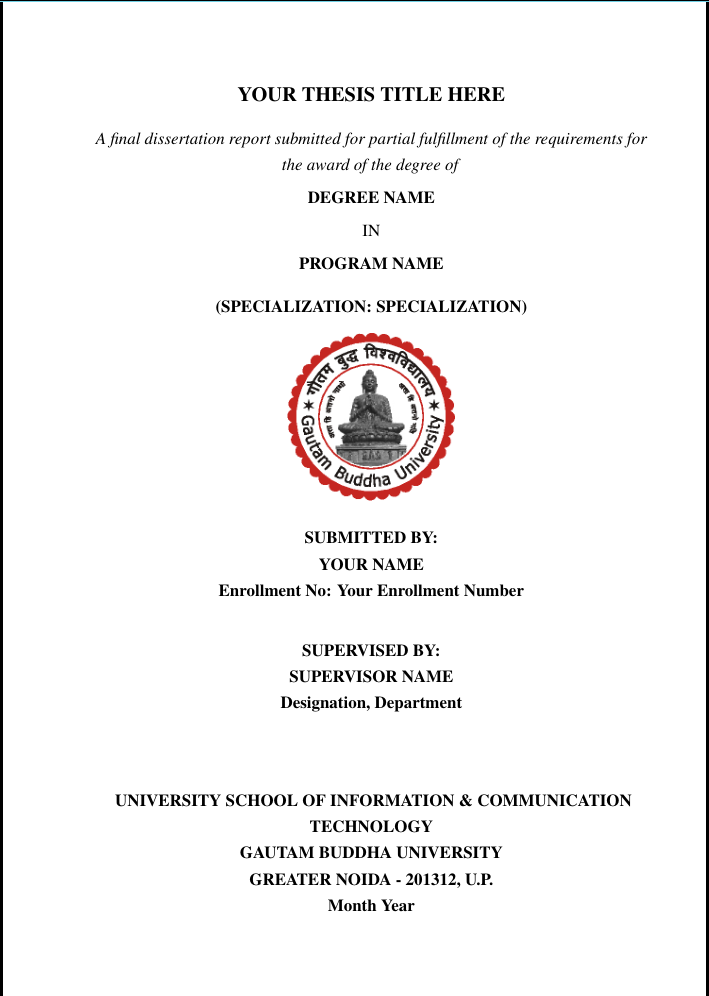

# 📜 SOICT-LaTeX-Kit – Thesis & Report Template for Gautam Buddha University

---

## 🚀 Overview

**SOICT-LaTeX-Kit** is a modular and extensible LaTeX thesis/report template tailored for students of **Gautam Buddha University (GBU)**. This class-based LaTeX system streamlines academic writing by automating formatting, structure, and style as per the university's official requirements.

---

## 🖼️ Preview



---

## 🎯 Who Is This For?

- ✅ **GBU students** writing their B.Tech, M.Tech, or Ph.D. dissertations or reports.
- ✅ Anyone looking for a **pre-formatted**, GBU-compliant LaTeX structure.
- ✅ Researchers or students who prefer a **clean, modular, and editable LaTeX template**.

---

## 📦 Features

- ✔ **Custom Class File** (`SOICTthesis.cls`) built on the `report` class.
- ✔ Auto-generated **Title Page, Declaration, Acknowledgment**, TOC, LOF, LOT, and Bibliography.
- ✔ **Minimal setup** – ready to compile on **Overleaf** or any LaTeX IDE (TeXstudio, VS Code, etc.).
- ✔ Preloaded support for **algorithms**, **figures**, **tables**, and **references**.
- ✔ Easy **modular chapter inclusion** via `\include{}` or inline sections.

---

## 📐 Formatting Standards

| 🧱 **Element**                  | 🎨 **Specification**                                               |
| ------------------------------- | ------------------------------------------------------------------ |
| **Base Class**                  | `report` (`a4paper`, `12pt`)                                       |
| **Font**                        | Times (`\usepackage{times}`)                                       |
| **Line Spacing**                | 1.5 (`\onehalfspacing`)                                            |
| **Text Justification**          | Fully justified (`\justifying`)                                    |
| **Paragraph Indent**            | `0pt`                                                              |
| **Paragraph Skip**              | `6pt`                                                              |
| **Margins**                     | Left: 2.5cm, Right: 1.5cm, Top/Bottom: 1in                         |
| **Chapters**                    | Centered, `CHAPTER-X` label with uppercase headings                |
| **TOC / LOF / LOT Headings**    | Bold, centered, uppercase                                          |
| **Bibliography Label**          | "REFERENCES", centered (styled as `\section*`)                     |
| **Title Page Generation**       | Auto-filled via commands like `\thesistitle{}` and `\authorname{}` |
| **Declaration Page**            | Auto-generated with prefilled supervisor/student data              |
| **Acknowledgment Page**         | Included by default with command `\acknowledgement`                |
| **Figures and Tables**          | Use `[H]` placement (via `float` package)                          |
| **Image Directory**             | All figures should reside inside `Assets/`                         |
| **Clickable References**        | Enabled (`hyperref`)                                               |
| **Abbreviations Section**       | Placeholder via `\startAbbreviations`                              |
| **Header/Footer Support**       | Included (`fancyhdr`) – can be extended                            |
| **Compiler Compatibility**      | XeLaTeX, PDFLaTeX, Overleaf                                        |
| **Anti-Plagiarism Declaration** | Included in candidate declaration automatically                    |

---

## 🔧 Auto-Fill Metadata Commands

Customize your report by setting the following fields in `Thesis.tex`:

```latex
\thesistitle{Your Thesis Title}
\authorname{Your Name}
\degree{B.Tech / M.Tech / Ph.D}
\program{CSE / IT / etc.}
\specialization{AI / Data Science / etc.}
\university{Gautam Buddha University}
\submissiondate{March 2025}
\enrollmentno{GBU/21XXX}
\supervisor{Dr. Supervisor Name}{Professor, Department of CSE}

```

## 📥 Installation & Usage

### 📌 1. Clone or Download

```bash
git clone https://github.com/yourusername/SOICT-LaTeX-Kit.git
```

Or download the ZIP archive and extract it locally.

---

### 📌 2. Edit Your Thesis

- Open `Thesis.tex`.
- Replace the placeholders with your actual content.
- Add or modify sections as needed.
- Use `\chapter{}` and `\section{}` to structure your report.

---

### 📌 3. Compile the Document

- **Preferred Compiler:** XeLaTeX
- Supported on: **Overleaf**, **TeXstudio**, **VS Code** (with LaTeX Workshop), etc.

---

## 🛠️ Customization Tips

- Want to **modify layouts or margins**? Edit `SOICTthesis.cls`.
- Need to **add more chapters**? Use `\include{Chapters/ChapterName}`.
- Generalizing for **non-GBU use**? Please consult your supervisor and open a PR.

---

## 🔄 Maintenance & Future Updates

- 🎓 Aimed to become the **standard template** for all GBU SOICT submissions.
- 🛠️ Periodically updated based on faculty or university recommendations.
- 📌 **Overleaf Template Upload Pending** (will be linked here soon).

---

## 🧪 Contribution Guidelines

### 🤝 Contributions Welcome!

This is a **community-supported template**. Feel free to open issues or submit PRs to improve it.

### 📬 Support & Feedback

- Found a bug or typo? [Open an Issue](https://github.com/yourusername/SOICT-LaTeX-Kit/issues)
- Want to contribute a feature? Submit a Pull Request!

---

## 🪪 License

Pending official university approval. Until then, it is intended for **personal academic use only**.

---

## 🖋️ Author Note

> This project is maintained by the student community of GBU SOICT.
> If you found it useful, consider giving it a ⭐️ or sharing with your peers!

---

## 🔗 Repository

[🌐 GitHub Repository](https://github.com/ashish-kus/SOICT-LaTeX-Kit)

---

Let me know if you want a cleaned-up `.zip` ready for Overleaf or help generating a `.cls` documentation file!
